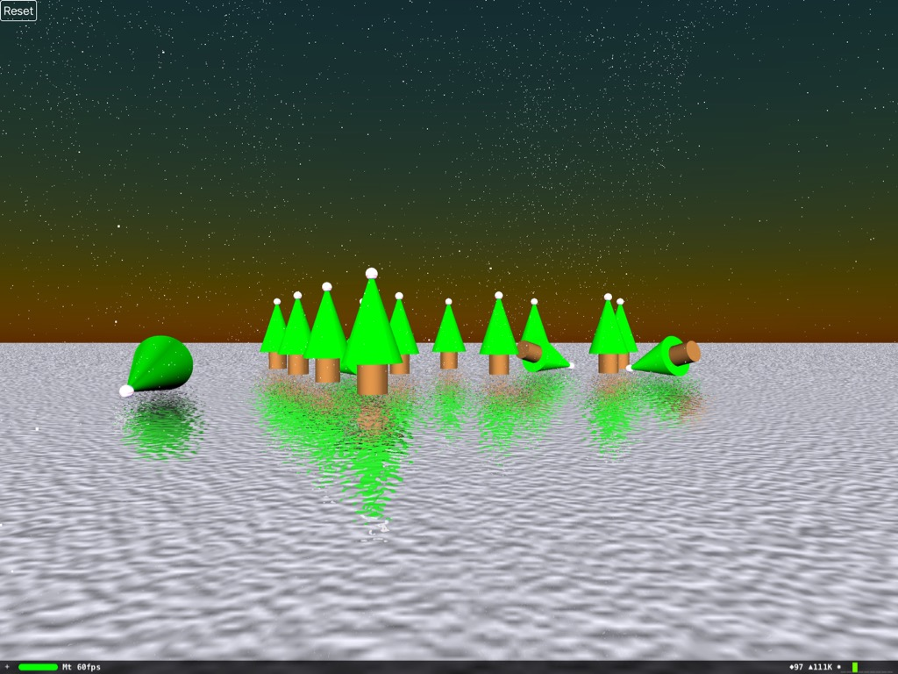

# Christmas-Tree-Bowling
Apple Pencil Controlled Christmas Tree Bowling!



Here's some festive fun: an Apple Pencil controlled bowling game using SceneKit. The Pencil controls the bowling ball's direction and, since it's Christmas, the pins are Christmas trees. The audio is, of course, handled by AudioKit.

This project was slightly cobbled together in a hurry to get it out during the festive season and, with that in mind, I hope you'll forgive the fact that everything is jammed into a single view controller. 

##Setting The Scene

The scene itself is pretty standard, consisting of an icy floor with a slight normal map and a handful of Christmas trees that act as the pins. The trees are actually composite nodes consisting of a cylinder trunk, a cone for the tree "body" and a small spherical bauble. To create the tree instances from the composite, I have a variable that returns the full geometry:

```swift
    lazy var christmasTreeCompositeNode: SCNNode =
    {
        let cone = SCNCone(topRadius: 0, bottomRadius: 0.5, height: 1.5)
        let trunk = SCNCylinder(radius: 0.25, height: 0.5)
        let bauble = SCNSphere(radius: 0.1)
        
        let coneNode = SCNNode(geometry: cone)
        let trunkNode = SCNNode(geometry: trunk)
        let baubleNode = SCNNode(geometry: bauble)
        
        coneNode.position = SCNVector3(0, 0.5, 0)
        trunkNode.position = SCNVector3(0, -0.5, 0)
        baubleNode.position = SCNVector3(0, 1.2, 0)
     
        let christmasTreeCompositeNode = SCNNode()
        christmasTreeCompositeNode.addChildNode(coneNode)
        christmasTreeCompositeNode.addChildNode(trunkNode)
        christmasTreeCompositeNode.addChildNode(baubleNode)
        
        return christmasTreeCompositeNode
    }()
```

...and I use the `flattenedClone()` method to create a new node that contains those three geometries concatenated:

```swift
    let christmasTreeeNode = christmasTreeCompositeNode.flattenedClone()
```

That new `christmasTreeNode` is the same as any other SceneKit node, so I can set its physics body and position as I would with any other:

```swift
        christmasTreeeNode.physicsBody = SCNPhysicsBody(type: SCNPhysicsBodyType.Dynamic,
            shape: SCNPhysicsShape(geometry: christmasTreeeNode.geometry!, options: nil))
     
        christmasTreeeNode.position = SCNVector3((-spacing * Float(z) / 2) + (Float(x) * spacing),
            -1,
            -Float(z) * spacing)
```

##Santa's Magic Pencil

I've reused the technique I devised for my Pencil controlled image editing app to position the ball and its conical direction pointer. Both the `touchesBegan()` and `touchesMoved()` methods call `positionBallFromTouch()` which performs a hit test against an invisible plane, `touchCatchingPlane`, in front of the camera at the same 'z' position as the bowling ball's origin. Using that hit test data, and the azimuth and altitude data from the touch, I'm able to set the transform on `pointerNode` and the `ballNode`:

```swift
    func positionBallFromTouch(touch: UITouch)
    {
        guard let hitTestResult:SCNHitTestResult = sceneKitView.hitTest(touch.locationInView(view),
            options: nil)
            .filter( { $0.node == touchCatchingPlaneNode }).first else
        {
            return
        }
       
        pointerNode.position = SCNVector3(hitTestResult.localCoordinates.x, hitTestResult.localCoordinates.y, 5)
        pointerNode.eulerAngles = SCNVector3(touch.altitudeAngle, 0.0, 0 - touch.azimuthAngleInView(view) - halfPi)
        
        ballNode.position = SCNVector3(hitTestResult.localCoordinates.x,
            hitTestResult.localCoordinates.y,
            5)
    }
```

When the user lifts their Pencil, I fire off the ball in the direction they're pointing. To do that, I generate the physics body for the ball and create a heading vector for the ball based on some simple Pythagorean arithmetic based on the Pencil's azimuth vector and its altitude angle:

```swift
    override func touchesEnded(touches: Set<UITouch>, withEvent event: UIEvent?)
    {
        guard let touch = touches.first where touch.type == UITouchType.Stylus else
        {
            return
        }
        
        let physicsBodyBall = SCNPhysicsBody(type: SCNPhysicsBodyType.Dynamic,
            shape: SCNPhysicsShape(geometry: ballNode.geometry!, options: nil))
        
        ballNode.physicsBody = physicsBodyBall
        ballNode.physicsBody?.categoryBitMask = 1
        
        let altitude = ((halfPi - touch.altitudeAngle) / halfPi)
        
        let xx = -touch.azimuthUnitVectorInView(view).dx * altitude
        let yy = touch.azimuthUnitVectorInView(view).dy * altitude
        let zz = 1 - sqrt(xx * xx + yy * yy)
       
        let direction = SCNVector3(xx * velocity,
            yy * velocity,
            zz * -velocity)
    
        physicsBodyBall.applyForce(direction, impulse: true)
        physicsBodyBall.contactTestBitMask = 2
        
        pointerNode.hidden = true
    }
```

That heading vector, direction, is applied to the ball with applyForce().

##No Business Like Snow Business

What would a Christmas scene be without some snow? My snow effect is a SceneKit particle system that's emitted from a plane geometry above the pins. The geometry is simply defined and positioned:

```swift
    let snowPlane = SCNPlane(width: 10, height: 5)
    let snowNode = SCNNode(geometry: snowPlane)

    snowNode.position = SCNVector3(0, 7, 0)
    snowNode.eulerAngles = SCNVector3(Float(M_PI_2), Float(0.0), Float(0.0))

    scene.rootNode.addChildNode(snowNode)
```

Then I create a smooth noise field to get the snow particles drifting around rather than falling straight down:

```swift
    let field = SCNPhysicsField.noiseFieldWithSmoothness(1, animationSpeed: 0.1)
    field.falloffExponent = 0
    field.strength = 0.5
    
    snowNode.physicsField = field
```

The particle system is set up with some basic properties. These include a custom acceleration and defining the floor as a collider node where the snowflakes will vanish upon collision:

```swift
    let snowParticleSystem = SCNParticleSystem()
    snowParticleSystem.birthRate = 750
    snowParticleSystem.particleLifeSpan = 10
    snowParticleSystem.particleDiesOnCollision = true
    snowParticleSystem.colliderNodes = [floorNode]
    snowParticleSystem.warmupDuration = 10
    snowParticleSystem.affectedByGravity = false

    snowParticleSystem.acceleration = SCNVector3(0, -0.25, 0)
```

Finally, I set the particle system's emitter to be the plane, set the particles to be tiny dots and ensure they're affected by the noise field:

```swift
    snowParticleSystem.emitterShape = snowNode.geometry!
    snowParticleSystem.particleSize = 0.008
    snowNode.addParticleSystem(snowParticleSystem)

    snowParticleSystem.affectedByPhysicsFields = true
```

##Sleigh Bells Ringing

It's common knowledge that a Christmas tree makes the sound of sleigh bells if it topples over, so the final step is to add some audio effects courtesy of AudioKit. By setting my view controller to the SceneKit scene's `contactDelegate`, I can respond to each collision.

The first step was to define two `AKInstrument` classes, one for the sleigh bells and one for a struck metal bar for the bowling ball itself. The sleigh bells implementation looks like:

```swift
    class Sleighbells: AKInstrument
    {
        override init()
        {
            super.init()
            
            let note = BarNote()
            addNoteProperty(note.frequency)
            addNoteProperty(note.amplitude)
            
            let instrument = AKSleighbells.presetSoftBells()

            setAudioOutput(instrument)
        }
    }
```

My Conductor class adds those two instruments to the AudioKit orchestra and exposes a method, `play()`, to play either instrument at a given frequency and amplitude:

```swift
    func play(frequency frequency: Float, amplitude: Float, playMetalBar: Bool)
    {
        let barNote = BarNote(frequency: frequency, amplitude: amplitude)
        barNote.duration.value = 1.0
        
        if playMetalBar
        {
           metalBar.playNote(barNote)
        }
        else
        {
            sleighbells.playNote(barNote)
        }
    }
```

Back in the view controller, I want to respond to the beginning of a contact event, so in the `didBeginContact` version of the delegate's `physicsWorld` method, I use the contact test bit masks to distinguish whether the contact is between two trees (in which case I play the bells) or between the bowling ball and a tree (in which case I play the metal bar):

```swift
    func physicsWorld(world: SCNPhysicsWorld, didBeginContact contact: SCNPhysicsContact)
    {
        if contact.nodeA.physicsBody?.contactTestBitMask == 1 && contact.nodeB.physicsBody?.contactTestBitMask != 2
        {
            conductor.play(frequency: 440, amplitude: 0.025,  playMetalBar: false)
        }
        
        
        if (contact.nodeA.physicsBody?.contactTestBitMask == 2 && contact.nodeB.physicsBody?.contactTestBitMask == 1) ||
            (contact.nodeA.physicsBody?.contactTestBitMask == 1 && contact.nodeB.physicsBody?.contactTestBitMask == 2)
        {
            conductor.play(frequency: 440, amplitude: 0.05,  playMetalBar: true)
        }
    }
```
    
##Conclusion 

The first thing I'm amazed by is the speed of the simulation, with the physics and a particle system and the audio, my iPad Pro breezes along at 60fps. I even played with depth of field during development and that didn't affect the frame rate at all. Back in the late '90s, I was commissioned to produce a similar effect in CGI for a TV spot and that was taking several minutes a frame to render!

Secondly, hopefully, this is another example of alternative uses for the Pencil - this time as a game controller.

As always, the source code for this project is available at my GitHub repository here, enjoy! 
